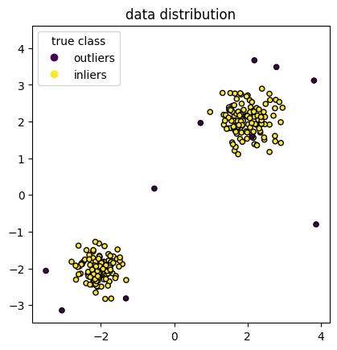

# 孤立森林

# 标签

无监督学习算法， 异常检测

# 一句话概括

异常值更容易被孤立，即更容易被划分到叶节点，所以更靠近树根部

**更容易**：被切分隔离的次数更少

**更靠近根部**：异常样本所属的叶节点离根节点有更短的路径

# 原理

- 异常点相比其他数据点较为疏离，只需少数几次切分就可以被隔离，即异常样本更容易被划分至叶结点，从而使得异常样本所属的叶结点距离根节点有更短的路径长度。
- 在 iTree 中，异常点被 isolated 之后更加靠近树的根部，而正常数据 isolated 之后在树中更深。

# 假设

- 异常的值是非常少的（如果异常值很多，可能被识别为正常的）
- 异常值与其他值的差异较大（这点也可以引出主要是全局上都为异常的异常，局部小异常可能发现不了，因为差异并不大）

# 算法流程

## 训练

- 抽取若干个样本构成子样本集，放置于根节点，用于训练单颗 iTree
- 随机选择一个特征 q 作为起始结点，然后在特征 q 的最大值和最小值之间随机选择一个值 p 作为分割点
- 根据属性 q 的取值进行分枝，把 q<p 的样本划分至左子节点，把 q>=p 的样本划分至右子节点
- 重复上两步，递归地构造左子节点和右子节点，直到满足以下条件之一：

  - 数据不可再分，即：只包含单个样本，或全部样本的取值相同
  - 二叉树达到了限定的最大深度
- 获得 t 个 iTree 之后，训练结束

## 检测

- **将训练数据 x 遍历每一棵 iTree，然后计算 h(x)、E(h(x))**

  - **h(x)：** 样本 x 从 iTree 的根节点到达叶结点所途径的路径长度，等价于样本 x 落入叶结点所需的划分次数
  - **E(h(x))：** 样本 x 在整个 iForest 上的平均路径长度  
- **计算：c(n) **

  [孤立森林异常值评分公式推导](https://zhuanlan.zhihu.com/p/609053828)

- **根据下列公式求异常分数**

$$
s(x,n)=2^{-E(h(x))/c(n)}
$$

s(x,n)的取值范围：(0, 1)；取值越大于 0.5 时，表示样本越有可能是异常值

- **根据异常分数判断样本是否异常**
  **异常分数与 E(h(x))成反比，与样本异常程度成正比**
  - 当 E(h(x))趋近于 c(n)时，s 趋近于 0.5，若所有样本的异常分数均接近 0.5，则表明数据中无明显异常值
  - 当 E(h(x))趋近于 0 时，s 趋近于 1，此时样本 x 极可能是异常值
  - 当 E(h(x))趋近于 n-1 时(即趋于最大划分次数)，s 趋近于 0，此时样本 x 极可能是正常值

# 优缺点

## 优点

1. **缓解 swamping 和 masking 的出现**

   - **swamping**：是指将正常样本识别为异常样本；
   - **masking**：是指异常样本没有被识别出来。
     这两种情况都是发生在数据量较大的情况下。
     **iForest 算法能有效地减缓上述两种情况发生的原因：**

   1. 子采样限制了训练单颗 iTree 的样本数，有助于增强 iTree 的区分能力
   2. 每一棵 iTree 的样本集和划分点都是随机产生的，因此每一棵 iTree 都具有独立性
2. 相比**基于距离或密度**的算法，iForest 节省了大量的计算成本
3. **高效性**: 孤立森林算法特别适合处理大数据集。它具有线性的时间复杂度，并且由于使用了子采样，使得在计算上更加高效。
4. **易于并行化**: 和随机森林一样，构建孤立树是独立的过程，构建森林可以并行化

## 缺点

1. **异常值比例敏感性**: 如果数据集中异常值的比例相对较高，孤立森林的效果可能就会下降，因为它是基于异常值“少而不同”的假设。
2. **对局部异常检测不敏感**：因为 少而不同的 前提条件决定主要解决全局异常的特点，对在局部区域表现出轻微异常特征的点检测不是很敏感
3. **不适用于多维特征情况**：iforest 不会因为特征的多少而降低算法的效率，但也正因为每次只随机用其中一个特征作为分割的特征，如果特征维度很高，就会有很多特征没有用到。

# 代码示例

## 数据准备

```python
import numpy as np
import matplotlib.pyplot as plt
from sklearn.model_selection import train_test_split

n_samples, n_outliers = 120, 10
rng = np.random.RandomState(0)
cluster_1 = 0.4 * rng.randn(n_samples, 2) + np.array([2, 2])
cluster_2 = 0.3 * rng.randn(n_samples, 2) + np.array([-2, -2])
outliers = rng.uniform(low=-4, high=4, size=(n_outliers, 2))

X = np.concatenate([cluster_1, cluster_2, outliers])
y = np.concatenate(
    [np.ones((2 * n_samples), dtype=int), -np.ones(n_outliers, dtype=int)]
)

scatter = plt.scatter(X[:, 0], X[:, 1], c=y, s=20, edgecolor="k")
handles, labels = scatter.legend_elements()
plt.axis("square")
plt.legend(handles=handles, labels=["outliers", "inliers"], title="true class")
plt.title("data distribution")
plt.show()
```



## 模型训练

```python
# 通过y的比例进行均匀拆分
X_train, X_test, y_train, y_test = train_test_split(X, y, stratify=y, random_state=42)

from sklearn.ensemble import IsolationForest

clf = IsolationForest(max_samples=100, random_state=0)
clf.fit(X_train)

# 得到score，Negative scores represent outliers, positive scores represent inliers
y_pre_score_test = clf.decision_function(cluster_1)
print(y_pre_score_test)

# -1为异常， 1为正常， 可以看下这个函数内部，就是score<0的设为-1
y_pre_label_test = clf.predict(cluster_1) 
print(y_pre_label_test)
```

## 可视化边缘

```python
# 通过网格的方式得到location的x和y坐标
xx, yy = np.meshgrid(np.linspace(-6, 6, 60), np.linspace(-6, 6, 60))
# concat x和y 得到输入的坐标
input_location = np.c_[xx.ravel(), yy.ravel()]

Z = clf.decision_function(input_location)
Z = Z.reshape(xx.shape)

plt.title("IsolationForest")
plt.contourf(xx, yy, Z, camp=plt.cm.Blues_r)
b1 = plt.scatter(X_train[:, 0], X_train[:, 1], c='white', s=20, edgecolor='k')
b2 = plt.scatter(X_test[:, 0], X_test[:, 1], c='green', s=20, edgecolor='k')
c = plt.scatter(outliers[:, 0], outliers[:, 1], c='red', s=20, edgecolor='k')
plt.axis('tight')
plt.xlim((-6, 6))
plt.ylim((-6, 6))
plt.legend([b1, b2, c],
           ["train data",
            "test data",
            "outlier"],
           loc="best")
plt.show()
```


# 参考

[https://zhuanlan.zhihu.com/p/678736441](https://zhuanlan.zhihu.com/p/678736441)

[https://zhuanlan.zhihu.com/p/609053828](https://zhuanlan.zhihu.com/p/609053828)
